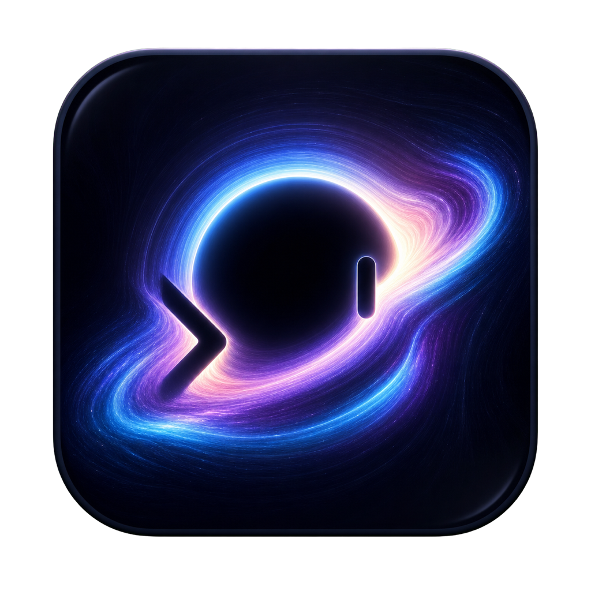
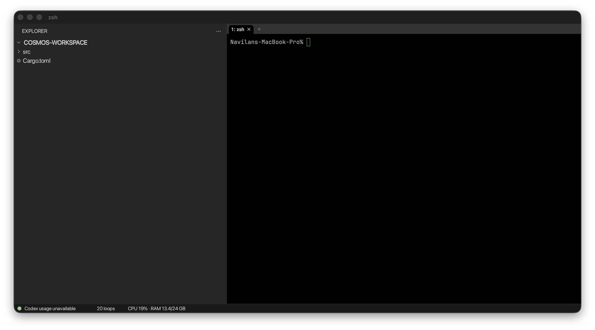

<p align="center">
  
</p>

<h1 align="center">Cosmos Term</h1>

<p align="center">
  A native terminal workbench with a pane-aware, VS Code-style filesystem
  Explorer—built directly on WezTerm.
</p>

<p align="center">
  <a href="https://github.com/NavilanSanthanakrishnan/cosmos-term/actions/workflows/ci.yml"></a>
  <a href="LICENSE.md"></a>
  
  
  
</p>



Cosmos Term is the terminal application itself—not an Electron wrapper and not
an editor embedding a terminal. It retains WezTerm's GPU renderer, PTYs, tabs,
splits, Lua configuration, and multiplexer support while adding a permanent
native Explorer and a small workbench status bar.

> [!IMPORTANT]
> Cosmos Term is an early macOS release for Apple silicon. The downloadable
> build is ad-hoc signed but not yet notarized.

## Why Cosmos Term?

Terminal work often alternates between the shell and a separate editor just to
answer simple filesystem questions. Cosmos keeps that context in the terminal
window without trying to become an editor.

| Capability | Behavior |
| --- | --- |
| Pane-aware Explorer | Follows the focused native or tmux pane |
| Exact folder scope | Shows only the active pane's current directory |
| Code OSS styling | Dark Modern colors, Seti file icons, native tree geometry |
| Live filesystem | Lazy reads, non-recursive watches, Git decorations |
| Native terminal core | WezTerm rendering, tabs, splits, config, and mux |
| Local status | Codex usage, loop count, CPU, and RAM without a daemon |
| Process isolation | Separate app identity, config, state, sockets, and protocol |

The Explorer is intentionally always visible. `Command+Shift+E` is consumed so
it cannot hide the workbench or leak a modified key into the shell.

## Install

### Download the macOS build

1. Download the latest `Cosmos-Term-macos-arm64.zip` from
   [Releases](https://github.com/NavilanSanthanakrishnan/cosmos-term/releases).
2. Unzip it and move `Cosmos Term.app` to `/Applications`.
3. On first launch, Control-click the app and choose **Open**. This is required
   while release builds are ad-hoc signed rather than Apple-notarized.

Cosmos does not replace or configure WezTerm. Both applications can run at the
same time.

### Build from source

Prerequisites:

- macOS on Apple silicon
- Xcode Command Line Tools
- current stable Rust toolchain
- Git with submodule support

```sh
git clone --recurse-submodules \
  https://github.com/NavilanSanthanakrishnan/cosmos-term.git
cd cosmos-term
cargo build --release -p wezterm-gui -p wezterm -p wezterm-mux-server
ci/package-cosmos-macos.sh
```

The signed local bundle is written to `dist/Cosmos Term.app`. Quit any older
Cosmos Term build before replacing the application in `/Applications`.

## Explorer

The active pane's exact working directory is the single visible root. Changing
directory with `cd` or focusing another split replaces the tree rather than
leaking parents, siblings, or historical roots.

Click a row to select it. Double-click a directory to open it in a new tab.
Drag the divider to resize the Explorer.

| Key while Explorer is focused | Action |
| --- | --- |
| `↑` / `↓` | Move selection |
| `←` / `→` | Collapse/parent or expand/child |
| `Return` | Expand or collapse |
| `Command+Return` | Open directory in a new tab |
| `Shift+Return` | Open directory in a split |
| `R` | Reveal the active pane |
| `.` | Toggle hidden files |
| `Escape` | Return focus to the terminal |

`L`, `F`, and `P` remain normal shell input. Clicking a terminal pane always
returns keyboard focus to that pane.

## Status bar

The thin bottom bar reads structured `token_count` events from the local Codex
session directory and counts only processes whose executable name is exactly
`codex`. It also shows system-wide CPU load and meaningful occupied RAM
(`used/total`) from native macOS counters. These values reuse the same worker
and are sampled as a stable ten-second rolling view: Cosmos does not launch a
daemon, helper, `top`, `ps`, `pgrep`, or Codex CLI process, and it creates no
additional status thread. On systems without Codex data, the Codex portion
remains unobtrusively unavailable while machine capacity continues to update.

## Close behavior

A clean install uses the standard confirmed `Command+W` and `Command+Q`
behavior. Existing protected-close users retain the password-masked autosave
flow automatically when a close-lock credential exists.

Optional integration paths:

| Environment variable | Purpose |
| --- | --- |
| `COSMOS_TERM_CLOSE_LOCK_FILE` | Explicit close-lock credential |
| `TMUX_MANAGER_STATE_DIR` | Directory containing `close-lock.json` |
| `TMUX_MANAGER_BIN` | Autosave executable |

The defaults are `$HOME/.local/state/tmux-manager/close-lock.json` and
`$HOME/.local/bin/tmux-manager`. Entered passphrases are verified in-process
and are not logged or placed in command arguments.

## Configuration and isolation

| Concern | Cosmos Term |
| --- | --- |
| Bundle ID | `com.navilan.cosmos-term` |
| User config | `~/.config/cosmos-term/cosmos.lua` or `~/.cosmos-term.lua` |
| Persistent data | `~/Library/Application Support/cosmos-term` |
| Runtime sockets/logs | `~/Library/Caches/cosmos-term/runtime` |
| Protocol environment | `COSMOS_TERM_UNIX_SOCKET`, `COSMOS_TERM_PANE` |
| Child terminal identity | `TERM_PROGRAM=CosmosTerm` |

`COSMOS_TERM_DATA_DIR` and `COSMOS_TERM_RUNTIME_DIR` can override the data and
runtime locations for isolated development or testing.

Cosmos does not read `~/.wezterm.lua`, use `WEZTERM_UNIX_SOCKET`, or direct its
CLI to a running WezTerm process. Parent WezTerm protocol variables and stale
tmux attachment variables are removed from new Cosmos shells.

## Architecture

Cosmos keeps product code close to explicit integration seams:

```text
cosmos-workspace
  directory cache · pane context · watchers · Git · Codex status
          │ non-blocking worker responses
          ▼
wezterm-gui/src/termwindow/cosmos.rs
  Explorer input · native layout · rendering · status bar
          │ narrow offsets and event routing
          ▼
WezTerm terminal core
  PTY · tabs · splits · mux · GPU renderer · Lua configuration
```

Start with:

- [Architecture](docs/cosmos-architecture.md)
- [Testing and isolation](docs/cosmos-testing.md)
- [Changelog](CHANGELOG.md)
- [Product vision](navilan-terminal-workspace-product-vision.docx)

## Project status

Current scope is macOS on Apple silicon. Near-term work includes notarized
release artifacts, automated release packaging, a newer WezTerm baseline, and
careful expansion of the workbench without turning the Explorer into an editor.

See [issues](https://github.com/NavilanSanthanakrishnan/cosmos-term/issues) and
[discussions](https://github.com/NavilanSanthanakrishnan/cosmos-term/discussions)
for active work.

## Contributing

Contributions are welcome. Read [CONTRIBUTING.md](CONTRIBUTING.md) before
changing the terminal core, native window integration, or tmux behavior.
Security issues should follow [SECURITY.md](SECURITY.md).

## Upstream and license

Cosmos Term is a fork of [WezTerm](https://github.com/wezterm/wezterm), created
by Wez Furlong and contributors. It currently tracks WezTerm commit
`5046fc225992db6ba2ef8812743fadfdfe4b184a`. Upstream copyright, MIT licensing,
font licenses, and Git history are retained.

Explorer visual conventions are derived from the MIT-licensed
[Code - OSS](https://github.com/microsoft/vscode) Explorer, Dark Modern theme,
and Seti icon theme. Cosmos uses its own native renderer and does not bundle or
launch VS Code.

Cosmos Term is independent and is not affiliated with or endorsed by WezTerm,
Wez Furlong, Microsoft, or the Visual Studio Code team.
