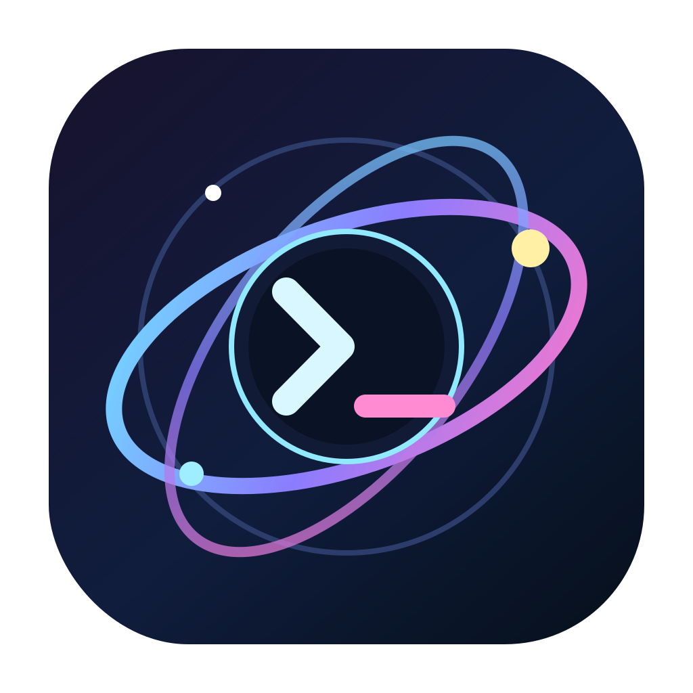

# Cosmos Term



Cosmos Term is a standalone, native fork of WezTerm with a VS Code-style
filesystem explorer integrated into the left side of every terminal window.
It retains WezTerm's terminal engine, tabs, splits, rendering, configuration
model, and multiplexer support while keeping its application identity and
runtime state separate from an installed WezTerm.

The current V1 is a macOS application based on WezTerm commit
`5046fc225992db6ba2ef8812743fadfdfe4b184a`, matching the WezTerm version that
was installed when this fork was created.

## V1

- Native, persistent, resizable explorer beside terminal tabs and splits
- Code OSS Explorer styling with the reference `#252526` background, 35 px
  title, 22 px rows, 13/15 px macOS system UI text, exact bundled Seti file
  icons, native chevrons, selection states, and scrollbar geometry
- Roomier defaults: a 520 px explorer, 14 pt text, and a 100 × 32 terminal
  viewport
- Right-aligned Git decorations for modified, added, deleted, renamed,
  untracked, and conflicted files, resolved off the render thread
- Permanent current-folder scope: the focused pane's exact working directory
  is the only visible root, so saved roots, parents, and siblings never leak
  into the tree
- tmux-aware reveal based on the selected tmux pane, including pane changes
- Lazy directory loading and live non-recursive filesystem watching
- Expand, collapse, keyboard navigation, and opening a selected directory in a
  new terminal tab or split
- Persistent sidebar width, expansion, and hidden-file preference
- Non-destructive inline errors for inaccessible or invalid paths
- Logical-pixel rendering that remains the same apparent size on 1× and Retina
  displays
- A native 22 px Dark Modern status bar with live Codex usage, next reset, and
  exact active-loop count

Cosmos Term is the terminal application itself—not a wrapper around WezTerm
and not an editor embedding a terminal.

## Explorer controls

The explorer is always visible, and the legacy `Command+Shift+E` chord is
intentionally inert. The header matches VS Code's compact `EXPLORER` title and
single ellipsis action. Clicking the ellipsis reveals the active pane's exact
working directory.

Dotfiles are shown by default to match the reference project view, except for
repository/runtime metadata such as `.git` and `.DS_Store`.

Click a row to select and expand/collapse it. Double-click a directory to open
it in a new tab. Drag the divider to resize the sidebar.

When the explorer has keyboard focus:

| Key | Action |
| --- | --- |
| `↑` / `↓` | Move selection |
| `←` / `→` | Collapse/parent or expand/child |
| `Return` | Expand or collapse |
| `Command+Return` | Open directory in a new tab |
| `Shift+Return` | Open directory in a split |
| `R` | Reveal the active pane |
| `.` | Toggle hidden files |
| `Escape` | Return focus to the terminal |

There is no Explorer hide or lock key binding. In particular, `L`, `F`, and
`P` remain normal terminal input. Clicking a terminal pane immediately returns
keyboard focus to the terminal.

`Command+W` asks for the custom close-lock passphrase, saves the workspace,
then permanently closes the current tab and every process in its panes.
Canceling or entering the wrong passphrase leaves the tab untouched.
`Command+Q` applies the same protected autosave flow to the whole application.
The password prompt is rendered and masked inside Cosmos Term; it no longer
opens a `tmux Manager` dialog or notification.

## Codex status

The thin bottom bar is always visible. It reads Codex rate-limit snapshots
from the structured `token_count` events in the local Codex session log and
counts only running executables named exactly `codex`; helpers are excluded.
The left side shows usage and active loops, while the right side shows the
next reset.

Updates run through the existing native workspace worker. There is no helper
daemon, launch agent, shell polling loop, or persistent background service.
The active session file is checked every two seconds, its contents are read
only when the file changes, and broader session-file discovery is cached.

## Isolation from WezTerm

| Concern | Cosmos Term |
| --- | --- |
| macOS bundle ID | `com.navilan.cosmos-term` |
| App | `/Applications/Cosmos Term.app` |
| User config | `~/.config/cosmos-term/cosmos.lua` or `~/.cosmos-term.lua` |
| Bundled fallback config | `Cosmos Term.app/Contents/Resources/cosmos.lua` |
| Persistent data | `~/Library/Application Support/cosmos-term` |
| Runtime sockets and logs | `~/Library/Caches/cosmos-term/runtime` |
| Protocol environment | `COSMOS_TERM_UNIX_SOCKET`, `COSMOS_TERM_PANE` |
| Config environment | `COSMOS_TERM_CONFIG_FILE`, `COSMOS_TERM_CONFIG_DIR` |
| Child terminal identity | `TERM_PROGRAM=CosmosTerm` |

Cosmos Term does not read `~/.wezterm.lua`, does not use
`WEZTERM_UNIX_SOCKET`, and cannot accidentally direct its CLI at a running
WezTerm GUI. The bundled config initially mirrors the personal WezTerm
behavior that existed when the fork was created. Parent WezTerm protocol
variables and stale tmux attachment variables are removed from new Cosmos
terminal shells.

## Build and package on macOS

Prerequisites are the same as the upstream WezTerm macOS build plus a current
Rust toolchain and Xcode Command Line Tools.

```sh
git submodule update --init --recursive
cargo build --release -p wezterm-gui -p wezterm -p wezterm-mux-server
ci/package-cosmos-macos.sh
```

The packaging script creates and ad-hoc signs `dist/Cosmos Term.app`. To
install a local build, quit any running Cosmos Term instance and copy that
bundle to `/Applications/Cosmos Term.app`.

For development checks:

```sh
cargo test -p cosmos-workspace
cargo check -p wezterm-gui -p wezterm -p wezterm-mux-server
```

See [Cosmos architecture](docs/cosmos-architecture.md) and
[testing](docs/cosmos-testing.md) for implementation and verification details.
The original product direction is retained in
[the product vision](navilan-terminal-workspace-product-vision.docx).

## Upstream and license

Cosmos Term is derived from [WezTerm](https://github.com/wez/wezterm), created
by Wez Furlong and contributors. The original copyright, MIT license, bundled
font licenses, and upstream history are retained. Cosmos-specific work is also
distributed under the repository's MIT license.

The explorer's layout metrics, Dark Modern palette, and Seti icon conventions
are based on the MIT-licensed
[Microsoft Code - OSS](https://github.com/microsoft/vscode) explorer,
list/tree, pane-header, default-theme, and Seti-theme sources. Cosmos Term uses
its own native renderer; it does not bundle or launch VS Code.
